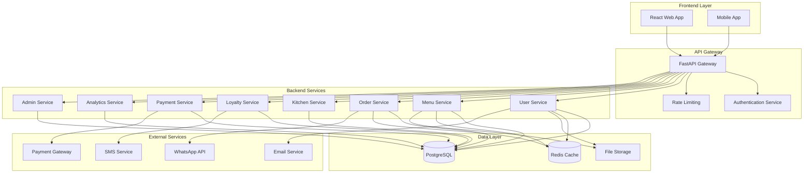

# Design Document

## Overview

The Restaurant Management SaaS platform is designed as a modern, scalable multi-tenant system built with FastAPI (Python) backend and React frontend. The architecture follows clean architecture principles with clear separation of concerns, supporting multiple restaurant businesses with complete data isolation and customizable features.

The system provides comprehensive restaurant management capabilities including menu management, order processing, kitchen operations, customer loyalty programs, payment processing, analytics, and administrative functions. Each tenant operates independently with their own data, users, and configurations while sharing the same underlying infrastructure.

## Architecture

### High-Level Architecture



### Technology Stack

**Backend:**
- **Framework:** FastAPI 0.111+ with Python 3.11
- **Database:** PostgreSQL 16.x with SQLAlchemy 2.0
- **Caching:** Redis for session management and frequently accessed data
- **Authentication:** OAuth2 with JWT tokens (python-jose)
- **Password Hashing:** Argon2 or bcrypt via passlib
- **Migrations:** Alembic for database schema versioning
- **Testing:** pytest with httpx for API testing
- **Documentation:** Automatic OpenAPI/Swagger generation

**Frontend:**
- **Framework:** React 19.1+ with modern hooks
- **UI Library:** Material-UI (MUI) for consistent design
- **State Management:** React Context API with useReducer for complex state
- **Routing:** React Router DOM for navigation
- **Charts:** Recharts for analytics visualization
- **HTTP Client:** Axios for API communication
- **Testing:** React Testing Library with Jest

**Infrastructure:**
- **Containerization:** Docker with multi-stage builds
- **Orchestration:** Kubernetes (optional) or Docker Compose
- **CI/CD:** GitHub Actions with automated testing and deployment
- **Monitoring:** Prometheus + Grafana for metrics and alerting
- **Logging:** Structured JSON logging with correlation IDs

### Multi-Tenant Strategy

The system implements a **shared database, shared schema** approach with tenant isolation through `organization_id` filtering:

- All tables include `organization_id` (foreign key to organizations table)
- Application-level filtering ensures data isolation
- Database indexes on `(organization_id, primary_key)` for performance
- Middleware automatically injects tenant context into all queries
- Row-level security (RLS) in PostgreSQL as additional protection layer

## Components and Interfaces

### Core Components

#### 1. Authentication & Authorization Service

**Responsibilities:**
- User registration, login, and password recovery
- JWT token generation and validation
- Role-based access control (RBAC)
- Multi-tenant user management

**Key Interfaces:**
```python
class AuthService:
    async def register_user(self, user_data: UserCreate, org_id: int) -> UserOut
    async def authenticate_user(self, credentials: UserCredentials) -> TokenResponse
    async def refresh_token(self, refresh_token: str) -> TokenResponse
    async def reset_password(self, email: str, org_id: int) -> bool
    async def verify_permissions(self, user_id: int, resource: str, action: str) -> bool
```

#### 2. Menu Management Service

**Responsibilities:**
- Product catalog management
- Category and ingredient tracking
- Image and media handling
- Pricing and availability management

**Key Interfaces:**
```python
class MenuService:
    async def create_product(self, product_data: ProductCreate, org_id: int) -> ProductOut
    async def get_menu_by_category(self, org_id: int, category_id: int) -> List[ProductOut]
    async def update_product_availability(self, product_id: int, available: bool, org_id: int) -> bool
    async def manage_ingredients(self, product_id: int, ingredients: List[IngredientAssignment]) -> bool
    async def upload_product_image(self, product_id: int, image_data: bytes, org_id: int) -> str
```

#### 3. Order Processing Service

**Responsibilities:**
- Order creation and management
- Order status tracking
- Table assignment
- Order calculations with promotions

**Key Interfaces:**
```python
class OrderService:
    async def create_order(self, order_data: OrderCreate, org_id: int) -> OrderOut
    async def update_order_status(self, order_id: int, status: OrderStatus, org_id: int) -> OrderOut
    async def get_orders_by_table(self, table_id: int, org_id: int) -> List[OrderOut]
    async def calculate_order_total(self, order_items: List[OrderItem], org_id: int) -> Decimal
    async def apply_promotions(self, order_id: int, promotion_ids: List[int]) -> OrderOut
```

#### 4. Kitchen Management Service

**Responsibilities:**
- Kitchen workflow management
- Order queue processing
- Preparation time tracking
- Kitchen display interface

**Key Interfaces:**
```python
class KitchenService:
    async def get_pending_orders(self, org_id: int) -> List[KitchenOrderOut]
    async def start_order_preparation(self, order_id: int, org_id: int) -> bool
    async def mark_order_ready(self, order_id: int, org_id: int) -> bool
    async def get_preparation_times(self, org_id: int) -> Dict[int, int]
    async def add_order_notes(self, order_id: int, notes: str, org_id: int) -> bool
```

#### 5. Customer Loyalty Service

**Responsibilities:**
- Loyalty program management
- Point accumulation and redemption
- Customer tier management
- Reward catalog

**Key Interfaces:**
```python
class LoyaltyService:
    async def register_customer(self, customer_data: CustomerCreate, org_id: int) -> CustomerOut
    async def award_points(self, customer_id: int, order_id: int, points: int, org_id: int) -> bool
    async def redeem_points(self, customer_id: int, reward_id: int, org_id: int) -> RedemptionOut
    async def get_customer_balance(self, customer_id: int, org_id: int) -> int
    async def calculate_tier_benefits(self, customer_id: int, org_id: int) -> TierBenefits
```

#### 6. Payment Processing Service

**Responsibilities:**
- Payment method handling
- Transaction processing
- Cash register management
- Financial reconciliation

**Key Interfaces:**
```python
class PaymentService:
    async def process_payment(self, payment_data: PaymentCreate, org_id: int) -> PaymentOut
    async def open_cash_register(self, initial_amount: Decimal, user_id: int, org_id: int) -> CashSessionOut
    async def close_cash_register(self, session_id: int, final_amount: Decimal, org_id: int) -> CashSessionOut
    async def record_cash_movement(self, movement_data: CashMovementCreate, org_id: int) -> CashMovementOut
    async def generate_daily_report(self, date: date, org_id: int) -> DailyReportOut
```

#### 7. Analytics Service

**Responsibilities:**
- Sales analytics and reporting
- Customer behavior analysis
- Operational metrics
- Data visualization support

**Key Interfaces:**
```python
class AnalyticsService:
    async def get_sales_summary(self, date_range: DateRange, org_id: int) -> SalesSummary
    async def get_popular_items(self, period: str, org_id: int) -> List[PopularItem]
    async def get_customer_analytics(self, org_id: int) -> CustomerAnalytics
    async def generate_custom_report(self, report_config: ReportConfig, org_id: int) -> ReportOut
    async def export_data(self, export_config: ExportConfig, org_id: int) -> bytes
```

### Frontend Component Architecture

#### 1. Layout Components
- **AppLayout:** Main application shell with navigation
- **Sidebar:** Module navigation and user menu
- **Header:** Breadcrumbs, notifications, and user profile
- **Footer:** System information and links

#### 2. Feature Modules
- **MenuModule:** Product catalog, categories, and menu display
- **KitchenModule:** Order queue, status management, and kitchen display
- **OrderModule:** Order creation, modification, and tracking
- **LoyaltyModule:** Customer management and loyalty program
- **PaymentModule:** Payment processing and cash management
- **AnalyticsModule:** Reports, charts, and data visualization
- **AdminModule:** System configuration and user management

#### 3. Shared Components
- **DataTable:** Reusable table with sorting, filtering, and pagination
- **FormBuilder:** Dynamic form generation with validation
- **ImageUploader:** File upload with preview and validation
- **DateRangePicker:** Date selection for reports and filters
- **StatusBadge:** Consistent status display across modules
- **LoadingSpinner:** Loading states and skeleton screens

## Data Models

### Core Entities

#### Organizations (Multi-Tenant)
```sql
CREATE TABLE organizations (
    id SERIAL PRIMARY KEY,
    name VARCHAR(100) NOT NULL,
    business_type VARCHAR(50),
    email VARCHAR(100) UNIQUE NOT NULL,
    phone VARCHAR(20),
    address TEXT,
    subscription_plan VARCHAR(50) DEFAULT 'basic',
    status VARCHAR(20) DEFAULT 'active',
    created_at TIMESTAMP DEFAULT NOW(),
    updated_at TIMESTAMP DEFAULT NOW()
);
```

#### Users
```sql
CREATE TABLE users (
    id SERIAL PRIMARY KEY,
    organization_id INTEGER REFERENCES organizations(id) ON DELETE CASCADE,
    email VARCHAR(100) NOT NULL,
    password_hash VARCHAR(255) NOT NULL,
    first_name VARCHAR(50),
    last_name VARCHAR(50),
    role VARCHAR(20) DEFAULT 'user',
    status VARCHAR(20) DEFAULT 'active',
    last_login TIMESTAMP,
    created_at TIMESTAMP DEFAULT NOW(),
    updated_at TIMESTAMP DEFAULT NOW(),
    UNIQUE(organization_id, email)
);
```

#### Menu System
```sql
CREATE TABLE categories (
    id SERIAL PRIMARY KEY,
    organization_id INTEGER REFERENCES organizations(id) ON DELETE CASCADE,
    name VARCHAR(100) NOT NULL,
    description TEXT,
    sort_order INTEGER DEFAULT 0,
    created_at TIMESTAMP DEFAULT NOW(),
    updated_at TIMESTAMP DEFAULT NOW()
);

CREATE TABLE products (
    id SERIAL PRIMARY KEY,
    organization_id INTEGER REFERENCES organizations(id) ON DELETE CASCADE,
    category_id INTEGER REFERENCES categories(id) ON DELETE SET NULL,
    name VARCHAR(100) NOT NULL,
    description TEXT,
    price DECIMAL(10,2) NOT NULL,
    available BOOLEAN DEFAULT TRUE,
    is_combo BOOLEAN DEFAULT FALSE,
    preparation_time INTEGER DEFAULT 0,
    created_at TIMESTAMP DEFAULT NOW(),
    updated_at TIMESTAMP DEFAULT NOW()
);

CREATE TABLE product_images (
    id SERIAL PRIMARY KEY,
    product_id INTEGER REFERENCES products(id) ON DELETE CASCADE,
    image_url VARCHAR(500) NOT NULL,
    alt_text VARCHAR(200),
    sort_order INTEGER DEFAULT 0,
    created_at TIMESTAMP DEFAULT NOW()
);
```

#### Order System
```sql
CREATE TABLE tables (
    id SERIAL PRIMARY KEY,
    organization_id INTEGER REFERENCES organizations(id) ON DELETE CASCADE,
    grid_id INTEGER REFERENCES table_grids(id) ON DELETE CASCADE,
    table_number INTEGER NOT NULL,
    row_position INTEGER NOT NULL,
    column_position INTEGER NOT NULL,
    capacity INTEGER DEFAULT 4,
    status VARCHAR(20) DEFAULT 'available',
    created_at TIMESTAMP DEFAULT NOW(),
    updated_at TIMESTAMP DEFAULT NOW()
);

CREATE TABLE orders (
    id SERIAL PRIMARY KEY,
    organization_id INTEGER REFERENCES organizations(id) ON DELETE CASCADE,
    table_id INTEGER REFERENCES tables(id) ON DELETE SET NULL,
    customer_id INTEGER REFERENCES customers(id) ON DELETE SET NULL,
    order_number VARCHAR(50) UNIQUE NOT NULL,
    status VARCHAR(30) DEFAULT 'pending',
    subtotal DECIMAL(10,2) DEFAULT 0,
    tax_amount DECIMAL(10,2) DEFAULT 0,
    discount_amount DECIMAL(10,2) DEFAULT 0,
    total_amount DECIMAL(10,2) DEFAULT 0,
    notes TEXT,
    created_at TIMESTAMP DEFAULT NOW(),
    updated_at TIMESTAMP DEFAULT NOW()
);

CREATE TABLE order_items (
    id SERIAL PRIMARY KEY,
    order_id INTEGER REFERENCES orders(id) ON DELETE CASCADE,
    product_id INTEGER REFERENCES products(id) ON DELETE RESTRICT,
    quantity INTEGER NOT NULL DEFAULT 1,
    unit_price DECIMAL(10,2) NOT NULL,
    total_price DECIMAL(10,2) NOT NULL,
    special_instructions TEXT,
    created_at TIMESTAMP DEFAULT NOW()
);
```

### Indexing Strategy

**Performance Indexes:**
```sql
-- Multi-tenant filtering
CREATE INDEX idx_users_org_email ON users(organization_id, email);
CREATE INDEX idx_products_org_category ON products(organization_id, category_id);
CREATE INDEX idx_orders_org_status ON orders(organization_id, status);
CREATE INDEX idx_orders_org_date ON orders(organization_id, created_at);

-- Search and filtering
CREATE INDEX idx_products_name_search ON products USING gin(to_tsvector('english', name || ' ' || description));
CREATE INDEX idx_customers_phone ON customers(organization_id, phone);
CREATE INDEX idx_loyalty_points_customer ON loyalty_transactions(customer_id, created_at);

-- Analytics queries
CREATE INDEX idx_orders_analytics ON orders(organization_id, created_at, status, total_amount);
CREATE INDEX idx_order_items_analytics ON order_items(product_id, created_at, quantity, total_price);
```

## Error Handling

### Error Response Format
```json
{
  "success": false,
  "error": {
    "code": "E_VALIDATION",
    "message": "Validation failed for the provided data",
    "details": {
      "field": "email",
      "reason": "Invalid email format"
    }
  },
  "meta": {
    "timestamp": "2025-01-15T10:30:00Z",
    "request_id": "req_123456789"
  }
}
```

### Error Categories

**Authentication Errors (E_AUTH_*):**
- `E_AUTH_INVALID_CREDENTIALS`: Invalid login credentials
- `E_AUTH_TOKEN_EXPIRED`: JWT token has expired
- `E_AUTH_INSUFFICIENT_PERMISSIONS`: User lacks required permissions
- `E_AUTH_ACCOUNT_LOCKED`: Account temporarily locked due to failed attempts

**Validation Errors (E_VALIDATION_*):**
- `E_VALIDATION_REQUIRED_FIELD`: Required field is missing
- `E_VALIDATION_INVALID_FORMAT`: Field format is invalid
- `E_VALIDATION_CONSTRAINT_VIOLATION`: Business rule violation

**Business Logic Errors (E_BUSINESS_*):**
- `E_BUSINESS_INSUFFICIENT_STOCK`: Product not available
- `E_BUSINESS_TABLE_OCCUPIED`: Table is already occupied
- `E_BUSINESS_LOYALTY_INSUFFICIENT_POINTS`: Not enough loyalty points

**System Errors (E_SYSTEM_*):**
- `E_SYSTEM_DATABASE_ERROR`: Database operation failed
- `E_SYSTEM_EXTERNAL_SERVICE_ERROR`: External service unavailable
- `E_SYSTEM_RATE_LIMIT_EXCEEDED`: API rate limit exceeded

### Error Handling Strategy

1. **Global Exception Handler:** Catch all unhandled exceptions and return consistent error responses
2. **Validation Middleware:** Validate request data before processing
3. **Circuit Breaker:** Prevent cascading failures from external services
4. **Retry Logic:** Automatic retry for transient failures
5. **Error Logging:** Structured logging with correlation IDs for debugging

## Testing Strategy

### Testing Pyramid

#### Unit Tests (70%)
- **Service Layer:** Business logic validation
- **Repository Layer:** Data access patterns
- **Utility Functions:** Helper functions and calculations
- **Validation Logic:** Input validation and sanitization

**Tools:** pytest, pytest-mock, factory-boy for test data

#### Integration Tests (20%)
- **API Endpoints:** Full request/response cycle testing
- **Database Operations:** Multi-table transactions
- **External Service Integration:** Mock external APIs
- **Authentication Flow:** End-to-end auth scenarios

**Tools:** pytest with httpx, testcontainers for database

#### End-to-End Tests (10%)
- **User Workflows:** Complete business processes
- **Cross-Module Integration:** Data flow between modules
- **Performance Testing:** Load testing critical paths
- **Security Testing:** Authentication and authorization

**Tools:** Playwright for frontend, pytest for API workflows

### Test Data Management

**Test Database Strategy:**
- Separate test database per test run
- Database migrations run before tests
- Transactional rollback after each test
- Factory pattern for test data generation

**Mock Strategy:**
- Mock external services (payment gateways, messaging)
- Mock file storage operations
- Mock time-dependent operations
- Preserve business logic in mocks

### Continuous Testing

**Pre-commit Hooks:**
- Code formatting (black, ruff)
- Type checking (mypy)
- Security scanning (bandit)
- Test execution for changed files

**CI Pipeline:**
- Parallel test execution
- Code coverage reporting (minimum 80%)
- Integration test environment
- Performance regression testing

## Security Considerations

### Authentication & Authorization
- **JWT Security:** Short-lived access tokens, secure refresh token rotation
- **Password Policy:** Minimum complexity requirements, breach detection
- **MFA Support:** Optional two-factor authentication
- **Session Management:** Secure session handling with proper timeout

### Data Protection
- **Encryption at Rest:** Database encryption for sensitive data
- **Encryption in Transit:** TLS 1.3 for all communications
- **PII Handling:** Proper anonymization and data retention policies
- **Audit Logging:** Comprehensive audit trail for compliance

### API Security
- **Rate Limiting:** Per-tenant and per-user rate limits
- **Input Validation:** Strict input sanitization and validation
- **CORS Policy:** Restrictive cross-origin resource sharing
- **API Versioning:** Secure deprecation of old API versions

### Infrastructure Security
- **Container Security:** Minimal base images, vulnerability scanning
- **Network Security:** Private networks, firewall rules
- **Secrets Management:** Secure storage of API keys and credentials
- **Monitoring:** Real-time security event monitoring and alerting